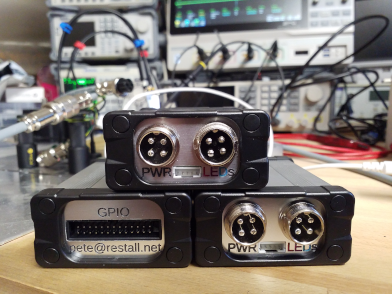
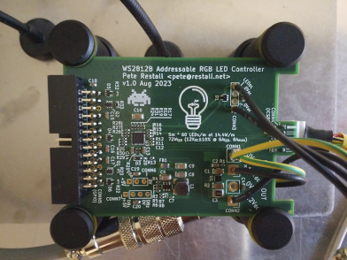

# Controller for Under-Cupboard RGB LED Strips

## What is this ?
My wife wanted our new kitchen to have unobtrusive under-cupboard lighting.  It seemed like a simple and relatively quick project so I decided to have
a bash.  Buying off-the-shelf is boring - there's nothing like building something yourself to see why things work as they do or are priced as they are.
This repository is the result of my effort.

### The LED Strips
The LED strips are adhesive-backed tapes stuffed with RGB '5050' LEDs running at 12V and having a single data line.  The data line is essentially an
SPI MOSI with an implicit 800kHz clock configured as a daisy-chain; there is no start bit as is common with other 'clockless' or one-wire protocols so
the data is encoded using pulse-width modulation, a `1` being a long pulse and a `0` being a short pulse.  The tape has 60 LEDs per metre for a power
consumption of 14.4W/m.  Since the supply rail is 12V there are three '5050' LEDs are driven serially with an [SM16703P](doc/datasheets/leds/SM16703P.pdf)
controller providing a constant current of around 17mA.  The [SM16703P](doc/datasheets/leds/SM16703P.pdf) is _similar_ to the more common
[WS2812B](doc/datasheets/leds/WS2812B.pdf).

### The Slave (LED Controller Board)
The controller board I put together is intended to be very simple with few bells and whistles.  It is based around a
[PIC16F15355](doc/datasheets/mcu/PIC16F15355-DS40001853C.pdf) microcontroller.  The controller is fairly dumb in that it is intended as a slave device,
receiving infrared commands via a [TSOP34440](doc/datasheets/infrared/TSOP34440.pdf) and then handling the generation of a frame buffer and its
serialisation onto the wire.  Each controller can output the frame buffer to one or two LED strips over CY 4-core control cable.  Over-current protection
for the LED strip power rail, as well as under- and over-voltage lock-out, are provided, as is a set of GPIO for future expansion.

The circuit was drawn in KiCad and the board was manufactured and assembled by JLCPCB.  To assemble the unit I soldered the through-hole parts (connectors
and wires) to the board and I cut the enclosure faceplates using a CNC router.  The firmware is assembler and is built using
[gputils](https://gputils.sourceforge.io/) since I keep forgetting how the Microchip XC8 compiler seems to deliberately produce bad code; redundant
`goto`s to eat cycles, that sort of thing.  The timing of the LED bitstream is tight enough using this microcontroller that such things matter.

### _[WIP]_ The Master (Voice Commands)
The project is being done in two stages.  The first stage is basic on / off control when you flip a switch.  That has been installed already and works
nicely.  The next stage will (the current work-in-progress) aims to allow voice control of the lighting without internet connectivity - no privacy concerns
or failed lighting when the rural broadband takes a dive.  Voice-to-intent _should not need an internet connection_.  Luckily there are frameworks that do
provide this such as one using an
[STM32F405 microcontroller and Picovoice](https://picovoice.ai/blog/offline-voice-assistant-on-an-stm32-microcontroller/)  A proof-of-concept I knocked
up in Python to control some other RGB LEDs in the house via infrared has shown this can work very well, with no model training required.

## The Repository
There are [Board Schematics](tree/master/src/schematics).

As well as some [Photographs](tree/master/doc/bench/photos).

There is the [LED Controller Firmware](tree/master/src/firmware/lights-gadget).

Plus various [Documentation](tree/master/doc) including [Datasheets](tree/master/doc/datasheets).
